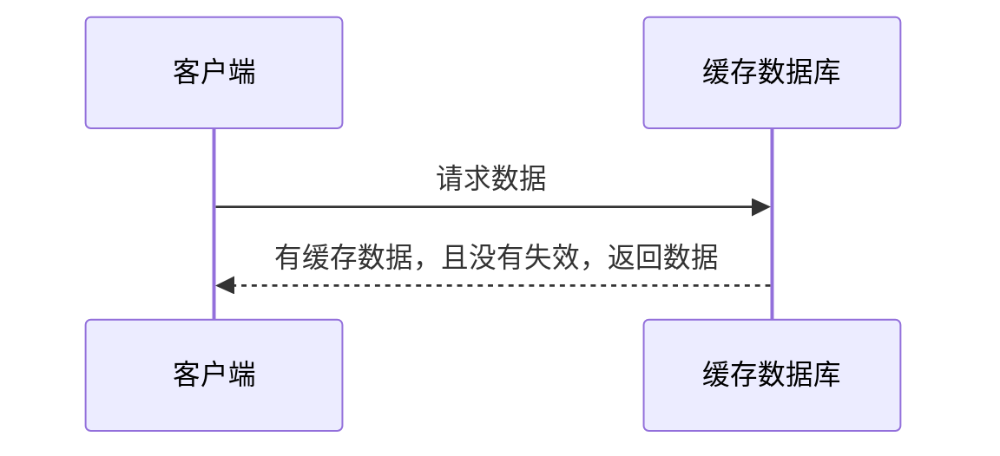
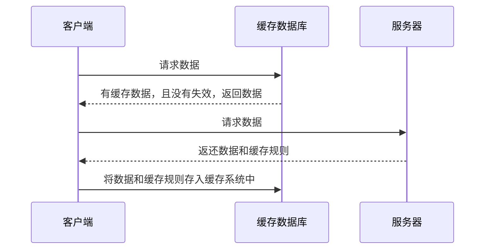
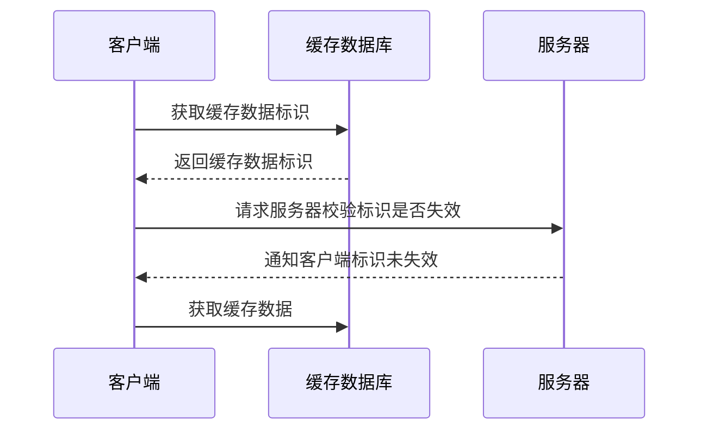
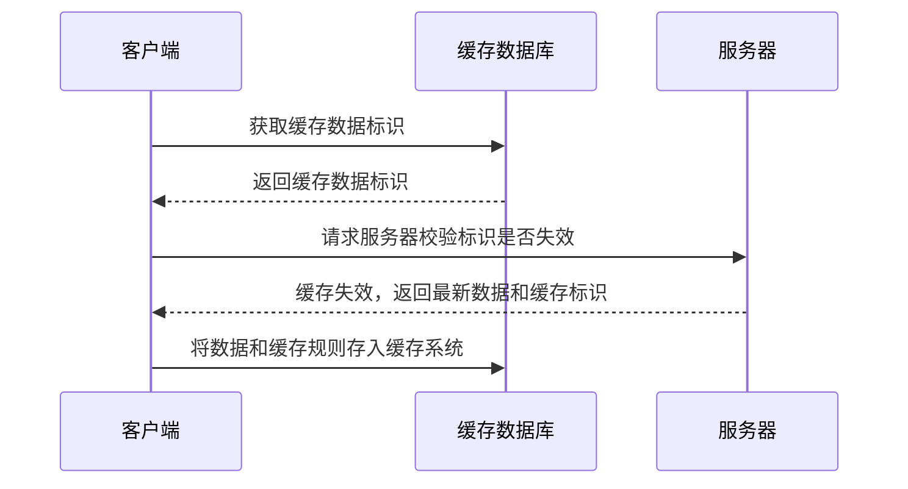

## 前言

HTTP 缓存作为客户端缓存的一种是 Web 性能优化的重要手段，了解其原理，对于前端应用开发维护和面试都有重要的意义。

HTTP 缓存分为两种：强缓存和协商缓存。两种缓存可以同时存在，强缓存的优先级高于协商缓存。当执行强缓存时且命中缓存，则直接使用缓存数据，不在进行缓存协商。当多种缓存方案同时存在时，新标准（HTTP1.1）比旧标准（HTTP1.0）优先。

## 强缓存

### 规则

当缓存中已经有要请求的数据时，且缓存未失效，客户端直接从缓存中读取数据；当缓存中没有要请求的数据时（或者缓存失效），客户端请求服务器，服务器返还数据和缓存规则，客户端将数据和缓存规则存入缓存中。



<p style="text-align:center;">强缓存，缓存命中</p>



<p style="text-align:center;">强缓存，缓存未命中</p>

### 方案

对于强制缓存，服务器响应头会用两个字段来表明，分别是：`Expires` 和 `Cache-Control`。

#### Expires

Expires 是 HTTP 1.0 时期的产物。它的值为服务端返回的数据到期时间。当再次请求时的请求时间小于此时间时，则使用缓存数据。但是由于服务器时间和客户端时间之间可能有误差，这会导致缓存命中出现误差。

#### Cache-Control

HTTP 1.1 产物，因为 Expires 的缺点，现在多使用 Cache-Control 作为替代。

- `private`：客户端可以缓存
- `public`：客户端和代理服务器都可以缓存
- `max-age=t`：在 t 秒后缓存内容将失效
- `no-cache`：需要使用协商缓存来验证数据
- `no-store`：所有内容都不缓存

## 协商缓存

### 规则

客户端会先从缓存数据库中获取到一个缓存数据的标识，拿到标识后会请求服务器校验缓存是否失效，如果没有失效服务端会返回 304 状态码，如果标识失效，服务器会返回最新的数据。



<p style="text-align:center;">协商缓存，缓存命中</p>



<p style="text-align:center;">协商缓存，缓存未命中</p>

### 方案

#### Last-Modified

`Last-Modified`：**最后修改时间**。服务器在响应时，告诉客户端资源的最后修改时间。

`If-Modified-Since`：**从某个时间点算起，资源是否被修改了**。客户端再次请求服务器时，请求头中会包含此字段，值为从缓存中获得的资源最后修改时间，也就是 `Last-Modified` 的值。服务器接收到请求后，将此值与资源的最后修改时间进行对比。

- 值相同：资源无修改，则响应 header，返回状态码 304。
- 值不同：资源已修改，则响应完整资源，返回状态码 200。

`If-Range`：用于断点续传的下载过程中，用来自从上传中断后，确保下载的资源没有发生改变。此字段既可以用 `Last-Modified` 做验证，也可以用 `Etag` 做验证。

`If-Unmodified-Since`：**从某个时间点算起，资源是否没有被修改**。与 `If-Range` 搭配使用，用来确保新的片段是未经修改的。

- 资源无修改，则响应完整资源，返回状态码 200。
- 资源被修改，则不传输，返回状态码 412 Precondition Failed。

#### Etag

`Etag`：服务器为当前资源生成的唯一标识。该标识由服务端根据特定算法计算得出，会占用一部分服务器资源。

`If-None-Match`：再次请求服务器时，请求头中将包含此字段，值为请求资源缓存的 `Etag` 的值。服务器接收到请求后，将此值与被请求资源的唯一标识符进行对比。

- 值相同，说明资源无修改，则响应 header，返回状态码 304，浏览器从缓存服务器获取资源。
- 值不同，说明资源被修改，则响应完整资源，返回状态码 200。

## 缓存实践

现代前端项目大都使用 Webpack 等工具打包，打包后的资源文件都带有 hash 值，因此只要将项目入口 index.html 设置为不缓存，其他带有 hash 的资源文件设置强缓存就行。只要文件内容发生变化，hash 会重新生成，资源文件的文件名发生了变化，浏览器自然会请求最新的文件，而不会使用缓存。

### index.html 设置不缓存

```bash
# nginx 设置项目入口 index.html 不缓存
location = /index.html {
  add_header Cache-Control "no-cache, no-store";
}
```

### webpack 打包配置

1. 设置合理的文件 hash：Webpack `output.filename` 应使用 `contenthash` 方案。这种方案将根据资源内容创建出唯一 hash。当资源内容发生变化时，`[contenthash]` 也会发生变化。
2. 将 webpack `runtime` 提取为单独的 chunk。
3. 将第三方库提取为单独的 `vendor` chunk，因为它们很少频繁修改，提取为单独 chunk，有利于长期缓存。
4. 设置 `moduleIds: 'deterministic'` 避免因模块解析顺序发生变化而导致文件 hash 值改变。

```js
module.exports = {
  output: {
    // 文件hash
    filename: '[name].[contenthash].js',
  },
  optimization: {
    moduleIds: 'deterministic',
    // runtime 单独打包为一个 chunk
    runtimeChunk: 'single',
    splitChunks: {
      cacheGroups: {
        // 第三方包打包为 vendors chunk
        vendor: {
          test: /[\\/]node_modules[\\/]/,
          name: 'vendors',
          chunks: 'all',
        },
      },
    },
  },
};
```

## 不同刷新的请求执行过程

- 浏览器输入 URL 后回车：浏览器如果发现缓存中已经有这个文件了，则不继续请求，直接取缓存，所以速度最快。

- F5：使用协商缓存，使用 `If-Modify-since` 询问服务器资源是否过期。

- Ctrl+F5：强制刷新，会先把缓存清理掉，再去请求资源。

## 参考

- [HTTP 缓存机制](https://juejin.cn/post/6844903517702848526)
- [Webpack 缓存](https://webpack.docschina.org/guides/caching/)
